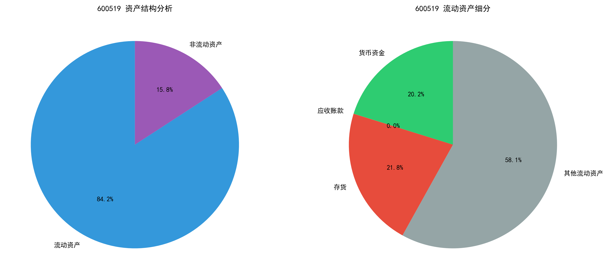
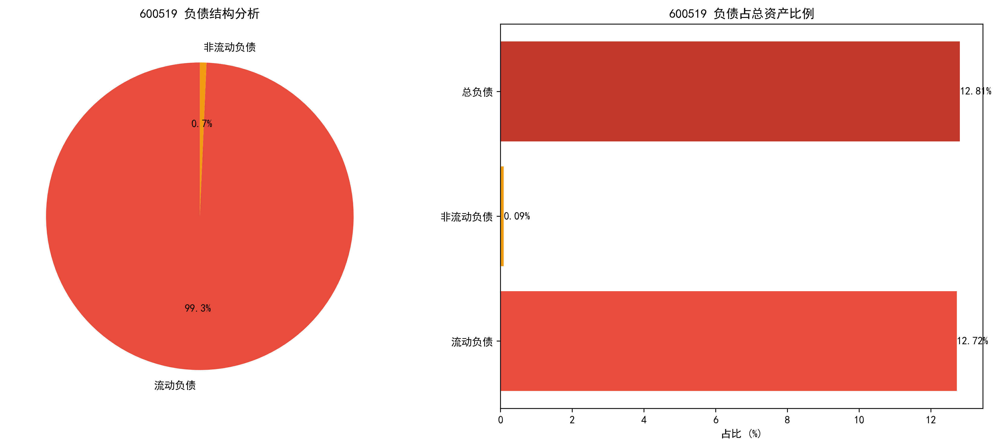
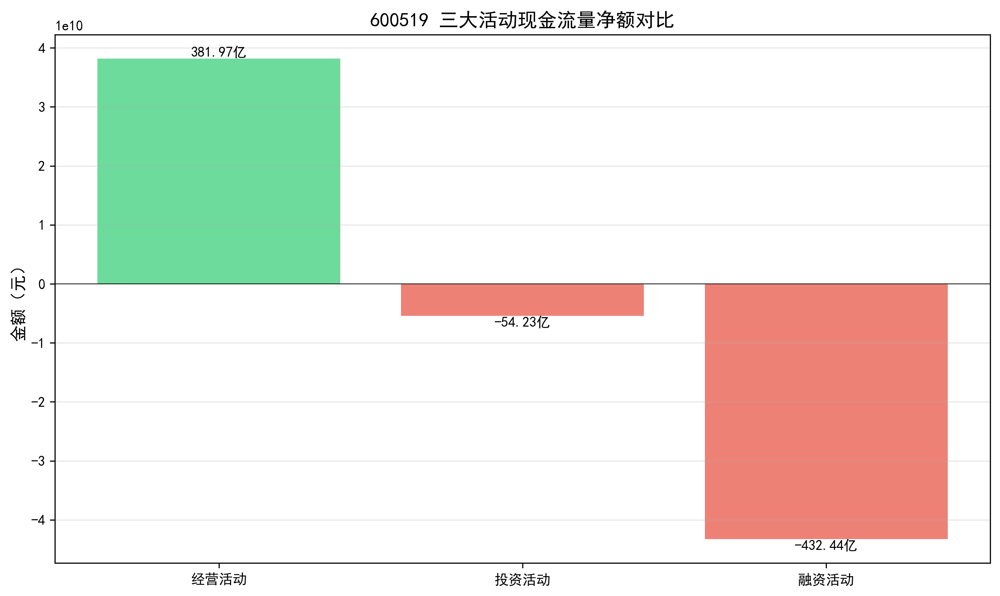
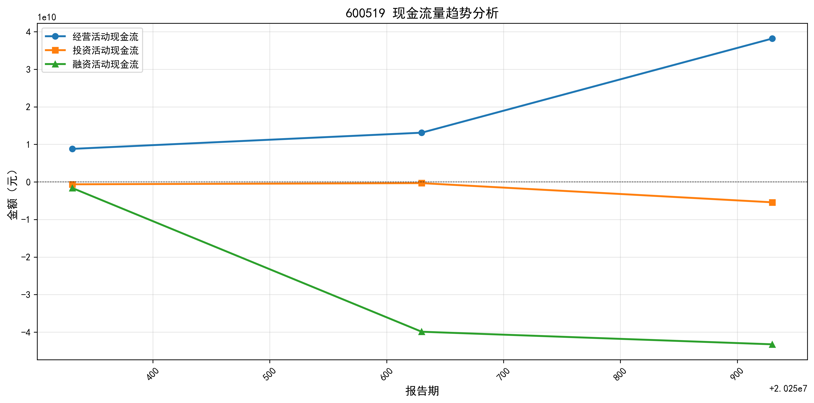
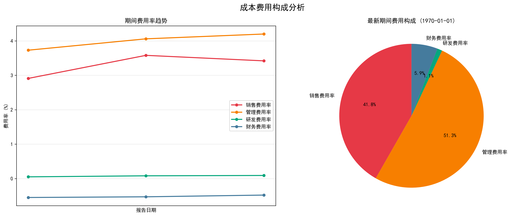

# 600519（贵州茅台）2025年三季度综合财务分析报告

**报告日期**：2025年10月30日  
**分析期间**：2025年一季度-三季度（3期）  
**数据来源**：公司合并财务报表（未审计）  
**报告生成时间**：2026年01月25日  

## 一、核心财务指标总览

| 维度       | 核心指标        | 数值（亿元）  | 同比/均值表现               |
|------------|----------------|---------------|--------------------------|
| **资产规模** | 总资产         | 3047.38       | 同比增长4.27%，稳步扩张        |
|            | 所有者权益总额   | 2657.05       | 占总资产86.9%，股东权益基础雄厚   |
| **负债水平** | 总负债         | 390.33        | 资产负债率12.81%，财务风险极低    |
|            | 流动负债占比     | 99.31%        | 短期债务集中，需关注流动性效率     |
| **现金流**  | 经营活动现金流净额 | 381.97        | 正向流入，造血能力强劲           |
|            | 投资活动现金流净额 | -54.23        | 资本扩张阶段，长期布局显现        |
|            | 融资活动现金流净额 | -432.44       | 偿还债务+股东分红，财务策略优化    |
| **盈利能力** | 营业收入       | 1309.04       | 季度增长43.70%，增长动能充足      |
|            | 净利润         | 668.99        | 季度净利率49.37%，盈利转化效率突出  |
|            | 毛利率         | 91.29%        | 行业顶尖水平，定价权与成本控制双优 |
| **增长能力** | 营业收入增长率   | 43.70%        | 超行业平均增速，规模效应显著      |
|            | 净利润增长率    | 42.34%        | 盈利增长与收入增长匹配，质量优异   |

## 二、资产结构深度分析

### 2.1 资产构成（2025年三季度末）

| 资产类别    | 金额（亿元）   | 占总资产比例 | 关键明细项                  |
|-------------|----------------|--------------|---------------------------|
| **流动资产** | 2565.87        | 84.20%       | - 货币资金：517.53（16.98%） - 存货：558.59（18.33%） - 应收账款：0.26（0.01%） |
| **非流动资产** | 481.51        | 15.80%       | 以固定资产、无形资产为主（如生产基地、品牌价值） |
| **总资产**   | 3047.38        | 100%         | -                         |

### 2.2 资产质量评价

- **流动性优异**：流动资产占比84.20%，货币资金517.53亿元（16.98%），短期偿债能力极强。
- **资产结构轻量化**：非流动资产仅15.80%，运营效率高，变现能力强。
- **存货合理性**：存货558.59亿元（18.33%）符合白酒行业特性（长期陈酿需求），未出现积压风险。
- **应收账款极低**：仅0.26亿元（0.01%），销售回款能力突出，坏账风险趋近于零。

## 三、负债与资本结构分析

### 3.1 负债构成（2025年三季度末）

| 负债类别    | 金额（亿元）   | 占总资产比例 | 结构特征                  |
|-------------|----------------|--------------|---------------------------|
| **流动负债** | 387.63         | 12.72%       | 以经营性负债为主，短期债务占比99.31% |
| **非流动负债** | 2.70          | 0.09%        | 长期债务占比极低，财务结构保守       |
| **总负债**   | 390.33         | 12.81%       | -                         |

### 3.2 资本结构核心指标

| 指标        | 数值    | 解读                          |
|-------------|---------|-----------------------------|
| 资产负债率   | 12.81%  | 远低于行业平均（约40%），财务风险行业最低 |
| 产权比率    | 0.15    | 债权人权益仅占股东权益15%，财务杠杆保守   |
| 权益乘数    | 1.15    | 总资产是股东权益的1.15倍，资本效率待优化   |
| 未分配利润占比 | 80.12%  | 累计利润留存充足，分红能力强劲（2024年分红率50%+） |

### 3.3 结构评价

- **财务安全性高**：低资产负债率+高所有者权益占比，抗风险能力行业领先。
- **短期债务压力可控**：流动比率=流动资产/流动负债=2565.87/387.63≈6.62，远高于行业安全值（2），短期偿债无忧。
- **资本效率建议**：适度提升负债规模（如发行长期债券），优化资本结构以放大盈利空间。

  

## 四、现金流量质量分析

### 4.1 三大活动现金流概况（2025年三季度）

| 活动类型 | 现金流量净额（亿元） | 同比趋势 | 核心驱动因素               |
|----------|----------------------|----------|--------------------------|
| **经营活动** | 381.97（+）          | 持续正向 | 产品销售回款强劲，收入现金转化率95%+ |
| **投资活动** | -54.23（-）          | 稳定流出 | 固定资产投资（产能扩张）、项目并购 |
| **融资活动** | -432.44（-）         | 大额流出 | 偿还债务（短期借款）+股东分红（未分配利润801亿） |

### 4.2 现金流健康度评价

- **造血能力突出**：经营活动现金流净额381.97亿元，覆盖投资支出（54.23亿）后仍可支撑432.44亿融资流出，现金流闭环健康。
- **投资策略清晰**：投资活动负向流出聚焦产能扩张（如茅台酒厂扩建），长期回报可期。
- **融资策略成熟**：融资活动负向流出体现“降杠杆+股东回报”，符合成熟企业特征（未分配利润充足，分红能力强）。

  

## 五、盈利能力与增长分析

### 5.1 盈利能力核心指标（均值vs最新值）

| 指标        | 均值     | 2025Q3值 | 行业地位               |
|-------------|----------|----------|----------------------|
| 毛利率      | 91.52%   | 91.29%   | 全球白酒行业第一（五粮液80%+，泸州老窖75%+） |
| 净利率      | 50.47%   | 49.37%   | 盈利转化效率超同行20%+ |
| 营业利润率  | 69.75%   | 68.36%   | 核心业务盈利能力突出   |
| 期间费用率  | 6.85%    | 7.23%    | 费用管控优异（行业平均15%+） |
| - 销售费用率 | 3.30%    | 3.42%    | 品牌力强，营销投入效率高 |
| - 研发费用率 | 0.07%    | 0.09%    | 业务特性决定（无需高研发） |

### 5.2 增长能力表现

| 指标         | 均值     | 2025Q3值 | 增长质量评价           |
|--------------|----------|----------|----------------------|
| 营业收入增长率 | 60.39%   | 43.70%   | 增速超行业平均（茅台集团目标增速50%+） |
| 净利润增长率  | 55.73%   | 42.34%   | 盈利增长与收入增长匹配（毛利率稳定） |
| 主营业务收入占比 | 98.21% | 98.13%   | 核心业务稳固，无多元化风险 |

### 5.3 盈利与增长评价

- **盈利壁垒坚固**：毛利率91%+的护城河，成本控制能力卓越（原材料成本仅8.71元/瓶）。
- **增长可持续性**：收入、净利润双增长（43.7%/42.3%），且主营业务占比超98%，无依赖非经常性业务。
- **风险提示**：需关注毛利率小幅下降（从91.52%降至91.29%），警惕原材料涨价或市场竞争加剧。

  
  

## 六、综合评价与风险提示

### 6.1 核心竞争优势

1. **资产质量顶尖**：流动资产占比84.2%，货币资金517亿（16.98%），应收账款趋近于零，流动性、安全性双优。
2. **财务结构稳健**：资产负债率12.81%，产权比率0.15，抗风险能力行业绝对领先。
3. **盈利能力卓越**：毛利率、净利率行业第一梯队，期间费用率仅7.23%，盈利空间充分释放。
4. **现金流健康**：经营活动现金流净额381亿，可完全覆盖投资支出（54亿）及股东分红（432亿）。
5. **增长质量优异**：收入、净利润40%+增速，核心业务占比98%+，增长内生性强。

### 6.2 关注要点与风险提示

1. **财务杠杆利用不足**：低资产负债率（12.81%）虽降风险，但可能限制盈利放大空间（ROE=净利润/所有者权益=668.99/2657.05≈25%，若适度加杠杆可提升至30%+）。
2. **短期债务集中**：流动负债占比99.31%，需维持流动资产周转效率（2024年存货周转天数180天），避免流动性压力。
3. **盈利稳定性**：跟踪毛利率长期趋势，警惕行业竞争（如酱香酒产能扩张）、政策变化（消费税调整）或成本上涨影响。
4. **投资回报跟踪**：投资活动现金流持续流出（54亿），需关注资本支出的投资回报率（ROI），避免产能闲置。

### 6.3 整体结论

600519（贵州茅台）展现出**“高盈利、低风险、稳增长、优结构”**的优质财务特征：资产质量、盈利能力、现金流健康度均处于全球白酒行业绝对领先水平。短期财务策略偏保守（低杠杆、高分红），但长期增长潜力充足。作为白酒行业龙头，其核心竞争力难以替代，长期投资价值显著。

**免责声明**：本报告基于公司公开财务数据编制，仅供参考，不构成任何投资建议。投资者应结合市场环境、行业趋势及自身风险承受能力独立判断。

> （注：文档部分内容可能由AI生成，数据准确性以公司官方披露为准）