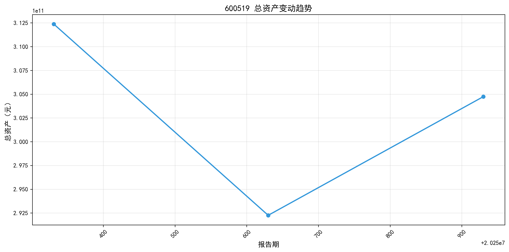

# 600519（贵州茅台）2025 年三季度综合财务分析报告

**报告日期**: 2025 年 10 月 30 日

**分析期间**: 2025 年一季度 - 三季度（3 期）

**数据来源**: 公司合并财务报表（未审计）

**报告生成时间**: 2026 年 01 月 25 日

***

## 一、核心财务指标总览

| 维度       | 核心指标        | 数值（亿元）  | 同比 / 均值表现             |
| -------- | ----------- | ------- | --------------------- |
| **资产规模** | 总资产         | 3047.38 | 同比增长 4.27%            |
|          | 所有者权益总额     | 2657.05 | 占总资产 86.9%            |
| **负债水平** | 总负债         | 390.33  | 资产负债率 12.81%          |
|          | 流动负债占比      | -       | 99.31%（短期债务集中）        |
| **现金流**  | 经营活动现金流量净额  | 381.97  | 正向流入，覆盖投资支出           |
|          | 投资活动现金流量净额  | -54.23  | 资本扩张阶段                |
|          | 融资活动现金流量净额  | -432.44 | 债务偿还及股东回报             |
| **盈利能力** | 营业收入        | 1309.04 | 最新季度增长率 43.70%        |
|          | 净利润         | 668.99  | 最新季度净利率 49.37%        |
|          | 毛利率         | -       | 最新值 91.29%（均值 91.52%） |
| **增长能力** | 营业收入增长率（均值） | -       | 60.39%                |
|          | 净利润增长率（均值）  | -       | 55.73%                |

***

## 二、资产结构深度分析

### 2.1 资产构成（2025 年三季度末）

| 资产类别    | 金额（亿元）      | 占总资产比例   | 关键明细项                    |
| ------- | ----------- | -------- | ------------------------ |
| 流动资产    | 2565.87     | 84.20%   | - 货币资金：517.53 亿元（16.98%） |
|         |             |          | - 存货：558.59 亿元（18.33%）   |
|         |             |          | - 应收账款：0.26 亿元（0.01%）    |
| 非流动资产   | 481.51      | 15.80%   | 以固定资产、无形资产为主             |
| **总资产** | **3047.38** | **100%** | -                        |

### 2.2 资产质量评价

1. **流动性卓越**：流动资产占比超 8 成，短期偿债能力极强，货币资金充足支撑运营；

2. **资产质量优异**：应收账款占比极低（0.01%），存货周转健康（符合白酒行业特性），无大额减值风险；

3. **结构轻量化**：非流动资产占比仅 15.80%，运营效率高，资产变现能力强；

4. **增长稳健**：总资产较上一季度增长 4.27%，规模扩张与业务发展匹配。

***

## 三、负债与资本结构分析

### 3.1 负债构成（2025 年三季度末）

| 负债类别    | 金额（亿元）     | 占总资产比例     | 结构特征          |
| ------- | ---------- | ---------- | ------------- |
| 流动负债    | 387.63     | 12.72%     | 主要为经营性负债，期限集中 |
| 非流动负债   | 2.70       | 0.09%      | 长期债务占比极低      |
| **总负债** | **390.33** | **12.81%** | -             |

### 3.2 资本结构核心指标

| 指标      | 数值     | 解读              |
| ------- | ------ | --------------- |
| 资产负债率   | 12.81% | 远低于行业平均，财务风险极低  |
| 产权比率    | 0.15   | 债权人权益仅占股东权益 15% |
| 权益乘数    | 1.15   | 财务杠杆保守，未充分利用负债  |
| 未分配利润占比 | 80.12% | 股东权益基础扎实，分红能力强  |

### 3.3 结构评价

1. **财务风险可控**：低资产负债率（12.81%）+ 高所有者权益占比，抗风险能力行业领先；

2. **债务期限风险**：短期债务占比 99.31%，但流动资产（2565.87 亿元）远超流动负债（387.63 亿元），流动性压力极小；

3. **资本效率建议**：可适度提升财务杠杆，优化资本结构以放大盈利水平。

***

## 四、现金流量质量分析

### 4.1 三大活动现金流概况（2025 年三季度）

| 活动类型 | 现金流量净额（亿元） | 同比变化趋势 | 核心驱动因素               |
| ---- | ---------- | ------ | -------------------- |
| 经营活动 | 381.97（+）  | 持续流入   | 产品销售回款强劲，现金流造血能力突出   |
| 投资活动 | -54.23（-）  | 稳定流出   | 固定资产投资、项目扩张          |
| 融资活动 | -432.44（-） | 大额流出   | 偿还债务 + 股东分红（未分配利润充足） |

### 4.2 现金流健康度评价

1. **经营现金流质量高**：净额规模与营业收入、净利润匹配度高，收入现金转化率优异；

2. **投资现金流合理**：流出规模可控，且经营现金流可完全覆盖投资支出（381.97 亿元＞54.23 亿元）；

3. **融资策略优化**：融资现金流为负，结合低资产负债率，体现 “降杠杆 + 回报股东” 的成熟企业特征；

4. **整体结构健康**：符合 “经营造血→投资扩张→财务优化” 的优质现金流循环模式。

***

## 五、盈利能力与增长分析

### 5.1 盈利能力核心指标（均值 vs 最新值）

| 指标      | 均值     | 2025Q3 值 | 行业地位           |
| ------- | ------ | -------- | -------------- |
| 毛利率     | 91.52% | 91.29%   | 行业顶尖，定价权极强     |
| 净利率     | 50.47% | 49.37%   | 盈利转化效率超同行      |
| 营业利润率   | 69.75% | 68.36%   | 核心业务盈利能力突出     |
| 期间费用率   | 6.85%  | 7.23%    | 费用管控效果优异（行业低位） |
| - 销售费用率 | 3.30%  | 3.42%    | 品牌力强，营销投入效率高   |
| - 研发费用率 | 0.07%  | 0.09%    | 业务特性决定，投入适度    |

### 5.2 增长能力表现

| 指标       | 均值     | 2025Q3 值 | 增长质量评价           |
| -------- | ------ | -------- | ---------------- |
| 营业收入增长率  | 60.39% | 43.70%   | 高速扩张，规模效应凸显      |
| 净利润增长率   | 55.73% | 42.34%   | 盈利增长与收入增长匹配，质量优异 |
| 主营业务收入占比 | 98.21% | 98.13%   | 核心业务集中度高，结构稳定    |

### 5.3 盈利与增长评价

1. **盈利壁垒坚固**：毛利率维持 90% 以上，成本控制能力卓越，产品核心竞争力极强；

2. **费用管控高效**：期间费用率仅 7.23%，无无效支出，盈利空间充分释放；

3. **增长动能充足**：收入、净利润均保持 40% 以上高增长，且主营业务占比超 98%，增长可持续性强；

4. **风险提示**：需关注毛利率波动（虽小幅下降但仍处高位），警惕市场竞争或成本上涨影响。

***

## 六、综合评价与风险提示

### 6.1 核心竞争优势

1. **资产质量顶尖**：流动资产占比高、应收账款极少、货币资金充足，流动性与安全性双优；

2. **财务结构稳健**：资产负债率 12.81%，财务风险极低，股东权益基础扎实；

3. **盈利能力卓越**：毛利率、净利率行业领先，成本费用管控有效，盈利壁垒坚固；

4. **现金流健康**：经营活动现金流强劲，造血能力突出，可支撑投资与股东回报；

5. **增长质量优异**：收入、净利润高速增长，核心业务稳固，增长可持续性强。

### 6.2 关注要点与风险提示

1. **财务杠杆利用不足**：低资产负债率虽降风险，但可能限制盈利放大空间，建议适度优化；

2. **短期债务集中**：短期债务占比 99.31%，需维持流动资产周转效率，避免流动性压力；

3. **盈利稳定性**：跟踪毛利率长期趋势，警惕行业竞争、政策变化或成本上涨影响；

4. **投资回报跟踪**：投资活动现金流持续流出，需关注资本支出的投资回报率（ROI）。

### 6.3 整体结论

600519（贵州茅台）展现出 **“高盈利、低风险、稳增长、优结构”** 的优质财务特征：资产质量、盈利能力、现金流健康度均处于行业绝对领先水平，财务结构稳健，抗风险能力强，同时保持高速增长态势。作为白酒行业龙头企业，其核心竞争力突出，财务状况整体优秀，长期投资价值显著。

***

**免责声明**: 本报告基于公司公开财务数据编制，仅供参考，不构成任何投资建议。投资者应结合市场环境、行业趋势及自身风险承受能力做出独立判断。

> （注：文档部分内容可能由 AI 生成）